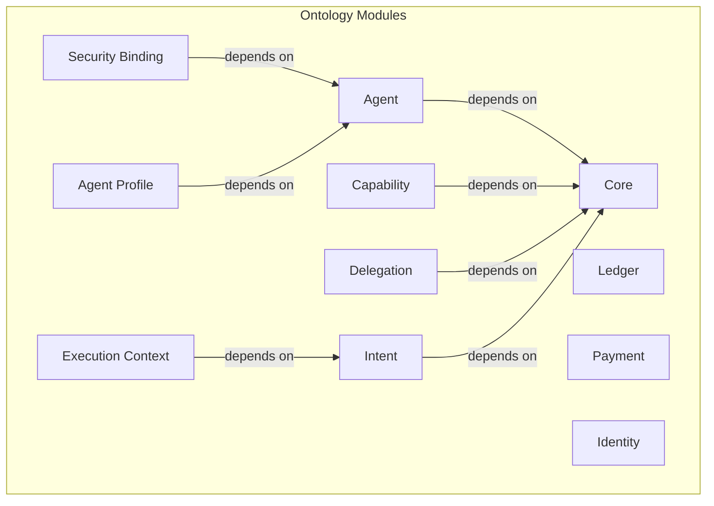

# W3C Semantic Agent Communication Community Group: Agent Semantic Communication Ontology

This repository contains the draft of formal ontology for AI Agent interoperability, security, and communication, developed as part of the **W3C Agent Semantic Communication Community Group** work. It provides a machine-readable, logically consistent framework for defining agents, their capabilities, and the rules governing their interactions, built upon core W3C standards like Decentralized Identifiers (DIDs) and Verifiable Credentials (VCs).

This CG defines the semantic meaning of agent interactions, not the transport, execution, or reasoning mechanisms used to process them.

## Vision and Goals

Our vision is to create a universal standard for safe and effective semantic communication among AI agents. This ontology serves as the foundational layer for a future where agents can securely delegate tasks, exchange value, and collaborate across different platforms and ecosystems.

**Key Goals:**
-   **Interoperability:** Define a shared vocabulary that allows agents from different developers to understand each other.
-   **Protocol-Agnostic:** Focus on the **semantic payload** of communication, ensuring the ontology can be used over any network protocol (HTTP, WebSockets, etc.) and is independent of specific agent implementations (e.g., LLMs).
-   **Security:** Anchor digital trust in physical reality by enabling agent identities and actions to be bound to hardware attestation, moving beyond purely digital security guarantees.
-   **Verifiability:** Create a complete, auditable chain of responsibility from intent to execution, providing the foundation for automated compliance, online arbitration, and system self-regulation.
-   **Extensibility:** Provide a modular core that can be extended to support diverse applications and domains.

---

## Core Ontology

The core Agent Semantic Communication Ontology, including all TTL, JSON-LD, and SHACL files, is now managed in a dedicated repository to better separate the formal standard from community governance and documentation.

➡️ **[Agent Ontology Core Repository](https://github.com/s-agent-comm/agent-ontology)**

This repository contains all the normative artifacts of the standard.

---

## High-Level Architecture

This repository now focuses on the high-level specifications, use cases, and community governance for the standard. The formal ontology modules, which are developed in the core repository, are structured as follows:

---

## Use Cases and Examples

To foster broader community engagement and provide a dedicated space for practical applications, all use cases and examples for the Agent Semantic Communication Ontology have been moved to a separate repository:

➡️ **[Agent Ontology Use Cases](https://github.com/s-agent-comm/agent-ontology-use-cases)**

This dedicated repository allows for independent evolution of practical examples, making it easier for developers to contribute and explore real-world implementations of the ontology.

---

## Key Specifications

The behavior and design of this ontology are guided by several key specification documents.

-   **Minimal Threat Model ([`specs/minimal-threat-model.md`](./specs/minimal-threat-model.md)):** This is a critical document that outlines the security threats the ontology is designed to mitigate. It is essential reading for understanding the "why" behind many of the security-related components.
-   **Core Ontology Concepts ([`specs/core-ontology.md`](./specs/core-ontology.md)):** Describes the foundational classes and properties.

---

## Contributing

We welcome contributions from the community! Please read our [`CONTRIBUTING.md`](./CONTRIBUTING.md) file to learn how you can get involved, whether it's by improving the ontology, adding examples, or enhancing the documentation.
