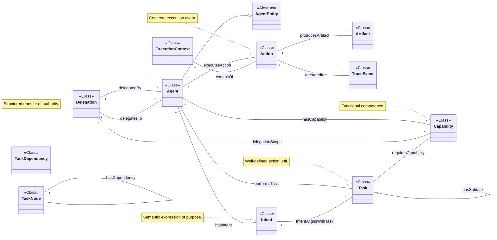

# Core Ontology Diagram

This diagram provides a high-level visualization of the core classes and properties defined in the `core.ttl` ontology module. It illustrates the fundamental relationships between agents, actions, capabilities, intents, and delegation.

